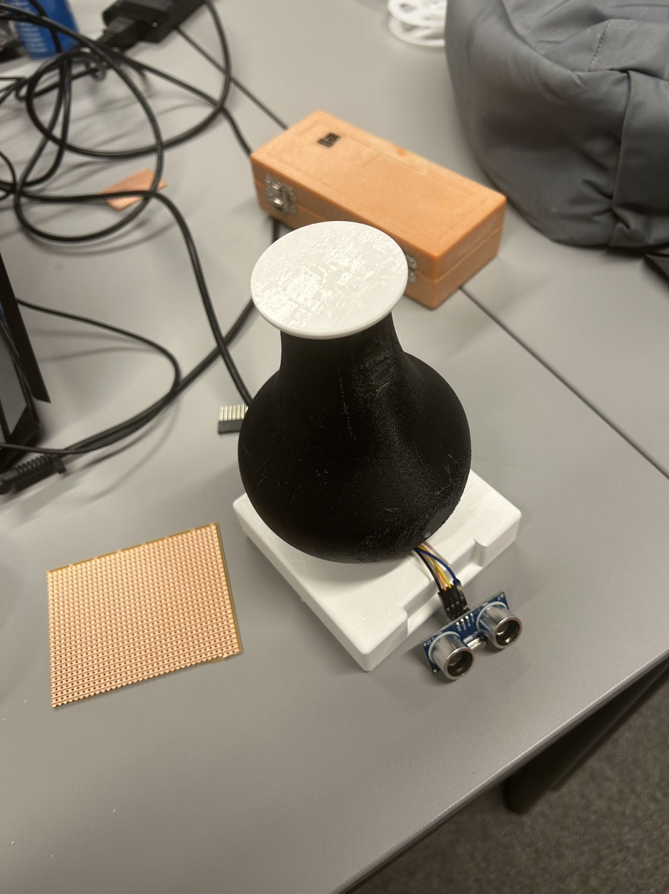

# ‘Don't touch my stuff’ lamp

## Background
In the lab, tools left on the table are often borrowed or moved while I’m away for soldering or 3D printing. This results in frequent searches across the lab to locate my tools. To address this issue, I designed a tool that acts as an assistant to monitor my equipment and notify me when items are moved or returned.

## Aim
This project aims to create a LED light ring controller, designed in the shape of a gas lamp, using a photoresistor and an ultrasonic distance sensor. 

### Function:
- **Distance-Colour**: The ultrasonic sensor measures the distance between the lamp and nearby objects.  
  - Within 20 cm: LEDs light up red.  
  - Beyond 20 cm: The color transitions from red to blue as the distance increases.  
- **Idle behavior**: When no object is detected, the LEDs progressively turn off at a rate of one LED per second. Upon detecting an object, all LEDs light up again.  
- **Photoresistor as a switch**: The photoresistor mimics the behavior of an oil lamp. Covering it turns off the LEDs, and uncovering it lights up the lamp.  

## Circuit and Software Design
This project builds upon hardware and software design concepts from the UCL CE coursework. All related code is stored in the `CE` folder. Below is a breakdown of the files and their purposes:

### Code Versions:
- **`sketch_cefinal3`**: Final version with full functionality.  
- **`sketch_cefinal1-1.2`**: Debugging the ultrasonic distance sensor, photoresistor, and MQTT publishing.  
- **`sketch_cefinal2-2.3`**: Testing the ring buffer and threshold filtering to remove noise.  
- **`sketch_ultrasonic_ranging`**: Ultrasonic ranging functionality.  
- **`sketch_contalled`**: MQTT connection and publishing.  
- **`sketch-firstcalss`**: Photoresistor input mapping and calibration.

### Circuit Design:
The circuit follows concepts from the UCL CASA0016 coursework [(1)] and includes:
- Ultrasonic distance measurements using the formula [(2)]:
 
  
- Formulae used for the conversion of ultrasound to centimetres

long duration = pulseIn(ECHO_PIN, HIGH);
float distance = (duration * 0.034) / 2.0;

after that:
To make the color transitions smoother, a buffer was implemented to calculate the average distance, resulting in a more stable distance curve. A threshold was also applied to filter out changes below 5 cm, preventing oscillations [(3)]. The MQTT connection and publishing functionalities were implemented with reference to the CASA0014: Connected Environments Lecture 6 workshop [(4)].

### Physical Design
The design is inspired by the kerosene lamp invented in 1853. It was modeled using Fusion 360 and 3D-printed. The model file is saved as `ce v5.3mf`.
 

### Prototype:
  
   
 
### Reference:
(1)University College London (UCL). (2024). CASA0016: Making, Designing & Building Connected Sensor Systems 24/25. Available at: https://workshops.cetools.org/codelabs/CASA0016-Workshop-1/index.html#7 (Accessed: 20 November 2024).
(2)University College London (UCL). (2024). CASA0016 Workshop 3: Using an Ultrasonic Range Finder. Available at: https://workshops.cetools.org/codelabs/CASA0016-Workshop-3/index.html#4 (Accessed: 19 November 2024).
(3)Arduino. (2024). Array. Available at: https://docs.arduino.cc/language-reference/en/variables/data-types/array/ (Accessed: 17 November 2024).// Knuth, D.E., 1997. The Art of Computer Programming: Volume 1: Fundamental Algorithms. 3rd ed. Reading, MA: Addison-Wesley.
(4)GitHub Repository, djduc (2024) Chrono Lumina Blinker example for MKR1010. GitHub. Available at: https://github.com/ucl-casa-ce/casa0014/blob/main/chronoLumina/mkr1010blinker/mkr1010blinker.ino (Accessed: 17 November 2024).

